# Projeto `<B-Side Dungeon>`

# Descrição

B-Side Dungeon é um jogo linear no qual o mundo a ser explorado é composto por salas,
e o jogador deve resolver puzzles para prosseguir entre tais salas;

Cada sala do mundo real está ligada a uma sala do "mundo invertido", adicionando a mecânica na qual
o protagonista tem a habilidade de “inverter o mundo”, permitindo que explore e atinja regiões antes inacessíveis;

A cooperação entre as ações realizadas nas salas normais e "invertidas" são essenciais para a resolução dos puzzles,
sendo o objetivo final: passar por todas as salas se libertando da Dungeon.

# Equipe
* `Guilherme Buzzetti De Souza` - `235883`
* `Paulo Vitor Rodrigues Nogueira` - `247309`

# Arquivo Executável do Jogo

[Executável](start.jar)

# Estrutura de Arquivos e pastas

~~~
├── README.md          <- apresentação do projeto
│
├── data               <- dados usados pelo jogo
│
│
├── images             <- imagens auxiliares para a apresentação 
│   
│
├── bin                <- arquivos em bytecode (.class)
│   └── game     
│
├── src                <- arquivos-fonte do projeto (.java)
│   └── game     
│
└── assets             <- mídias usadas no projeto
~~~

# Slides do Projeto

## Slides da Prévia

[Slides](slide.pdf)

# Instrucoes de instalacao

    git clone https://github.com/KernelPointers/mc322-projects #Clone o repositorio
    cd lab06 #Entre no diretorio do jogo
    java -jar start.jar #Execute o arquivo .jar

# Como jogar

## Controles

* `w` - move o personagem para frente 

* `a` - move o personagem para esquerda

* `s` - move o personagem para baixo

* `d` - move o personagem para direita

* `e` - interage com items

* `c` - coleta a chave

* `i` - inverte o mundo

# Diagramas

## Diagrama Geral da Arquitetura do Jogo

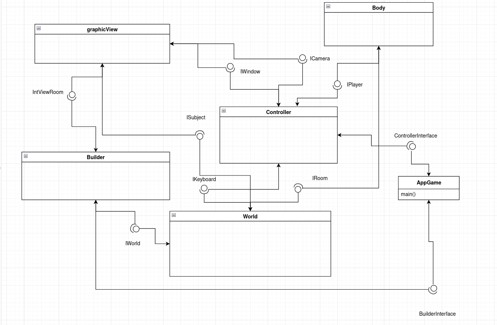

# Arquitetura

## Componentes

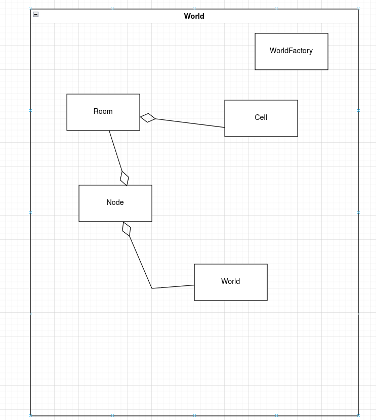
    
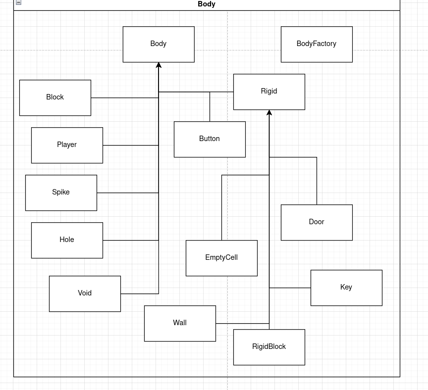
    
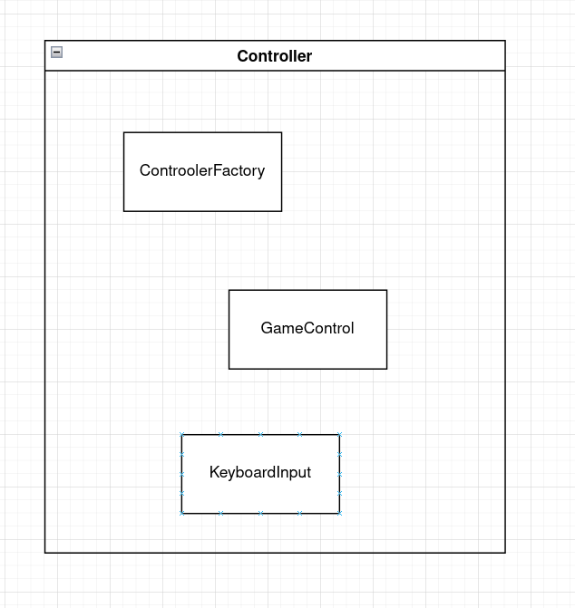
    
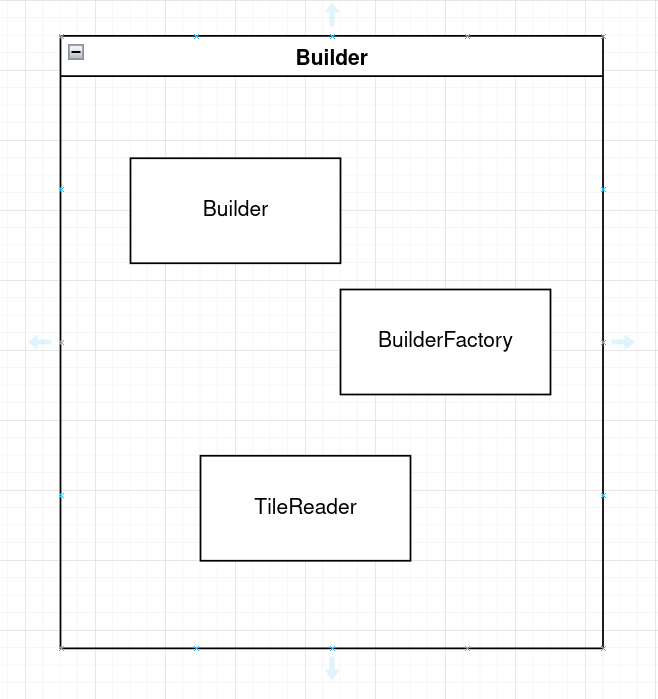
    
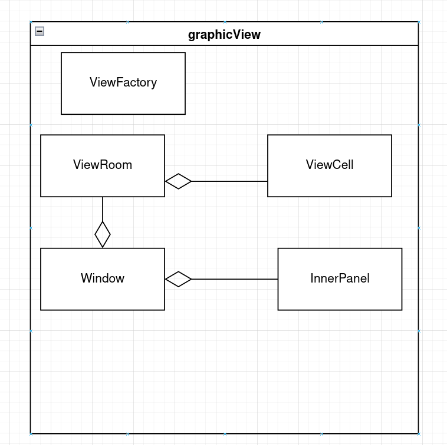

# Design Patterns

## Factory

Utilizamos o Design Pattern Factory para a instanciação dos Componentes principais
do jogo, de modo que o cliente fique isento da instanciação dos objetos

~~~java
   public class AbstractFactory {
        public static IntBuilderFactory createBuilderFactory(){
            IntBuilderFactory factory = null;
            factory = new BuilderFactory();
            return factory;
        }

        public static IntWorldFactory createWorldFactory(){
            IntWorldFactory factory = null;
            factory = new WorldFactory();
            return factory;   
        }

        public static IntBodyFactory createBodyFactory(){
            IntBodyFactory factory = null;
            factory = new BodyFactory();
            return factory;
        }

        public static IntControllerFactory createControllerFactory(){
            IntControllerFactory factory = null;
            factory = new ControllerFactory();
            return factory;
        }

        public static IgraphicViewFactory createViewFactory(){
            IgraphicViewFactory factory = null;
            factory = new ViewFactory();
            return factory;
        }
    }
~~~
    
## Observer

Utilizamos também o Design Pattern Observer para realizar a ligação entre os objetos da matriz de Células das Salas
e sua respectiva viewRoom, de modo que a atualização da tela seja feita dinâmicamente.

~~~ java
    public class Room implements IRoom, Subject{
        ...
        private ArrayList<IntViewRoom> subscribers = new ArrayList<IntViewRoom>();
        ...
  
        public void attach(IntViewRoom obs){
            this.subscribers.add(obs);
        }

        public void detach(IntViewRoom obs){
            this.subscribers.remove(obs);
        }
 
        public void changeTargetRoom(Room room){
            IntViewRoom obs = this.subscribers.get(0);
            obs.toogleRoomStatus();
            obs.setSubject(room);
            obs.build();
            this.detach(obs);
            room.attach(obs);
        }    

        public void notifyObserver(int i, int j, BufferedImage img, char id){
            for (IntViewRoom obs : this.subscribers) 
                obs.update(i, j, img, id);
        }
        
        ...
    }
~~~
~~~ java
    public interface IObs {
        public void update(int i, int j, BufferedImage img, char id);
        public void toogleRoomStatus();
        ...        
    }
~~~

# Destaques de Codigo

## Mecanicas

### Vetor de Orientacao e Interacao

O personagem possui um vetor que indica a posicao para onde esta encarando, 
isso nos permite saber com qual celula o player pretende interagir ou coletar
e modificar o seu sprite de acordo com sua direcao

~~~java
    public class Player extends Body implements IPlayer {
        …
        private int[] ori = new int[2]; // vetor de orientacao
        …

        public void changeVectorOrientation(char dir){
            this.dir = dir;

            if (dir == 'u'){
                ori[0] = 0;
                ori[1] = -1;
                this.spriteIndex = (3);
            } else if (dir == 'd'){
                ori[0] = 0;
                ori[1] = 1;
                this.spriteIndex = (2);
            } else if (dir == 'r'){
                ori[0] = 1;
                ori[1] = 0;
                this.spriteIndex = (0);
            } else if (dir == 'l'){
                ori[0] = - 1;
                ori[1] = 0;
                this.spriteIndex = (1);
            } 

        

            this.currentImg = img[spriteIndex];

            this.room.notifyObserver(this.i, this.j, this.currentImg, 'p');
            this.updateNextPos();
        }

        public void interact(){
            this.updateNextPos();

            char nextId = this.room.getId(nextI, nextJ);

            if (this.isLinked)
                this.unlink();
            else {
                switch(nextId){
                    case 'b' : 
                      this.linkBody(this.room.getBody(nextI, nextJ)); break;
                    case 'k' :
                        this.linkBody(this.room.getBody(nextI, nextJ)); break;
                    case 'd':
                        this.unlock();
                }
            }
        }

    …

    }
~~~

|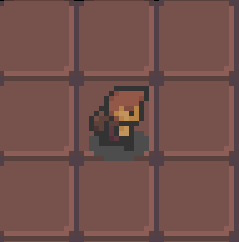 |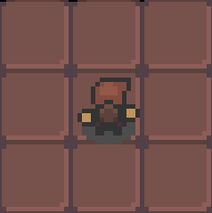|
|-|-|
|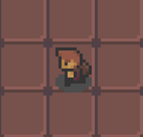 | 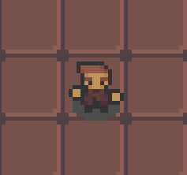

### Botoes

### Morrer

### Camera

A camera do jogo segue o personagem de forma a centralizar este na tela, isso
e feito atraves de uma transformada de coordenadas quando window decide que porcao
do view sera mostrado na tela

~~~java
    public int transformX(int x){
        int tileWidth = 80;
        return x - 
            (this.viewRoom.getPlayerJ() * tileWidth ) + 
            (this.viewRoom.getPlayerScreenJ() * tileWidth);
    }

    public int transformY(int y){
        int tileHeight = 72;
        return y - 
            (this.viewRoom.getPlayerI() * tileHeight) + 
            (this.viewRoom.getPlayerScreenI() * tileHeight);
    }

    public void drawComponent(Graphics2D g, int x, int y, BufferedImage img) {  
        if (img != null){
            int newX = transformX(x);
            int newY = transformY(y);
            g.setRenderingHint(RenderingHints.KEY_ANTIALIASING, 
                               RenderingHints.VALUE_ANTIALIAS_ON);
            AffineTransform restoreMatrix = g.getTransform();
            g.rotate(this.angle, this.viewRoom.getPlayerScreenI(), 
            this.viewRoom.getPlayerScreenJ());
            …
            g.drawImage(img, newX, newY, 80, 80, this);
            …
            g.setTransform(restoreMatrix);
        }

    }  

~~~

#### Transformada de coordenadas

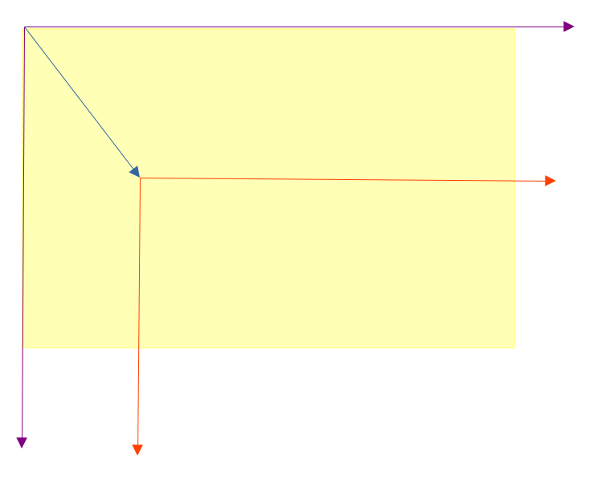

Dado esse referencial onde o eixo em roxo representa as coordenadas absolutas, e o emm vermelho
as coordenadas relativas ao Player, quremos levar os pontos do eixo absoluto para o eixo do player
desta forma, efetuamos a transformada T: (x, y) -> (x - Xpa + Xpt  , y - Ypa + Ypt)

Onde (Xpa, Ypa) e a coordenada absoluta do player e (Xpt, Ypt) e a coordenada do player em relacao 
a tela (origem do eixo de destino da transformada T)

| ||
