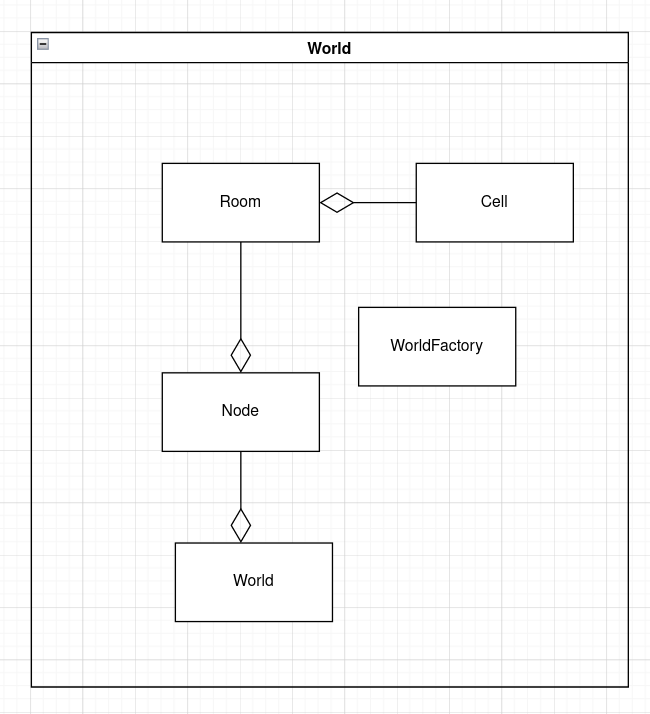
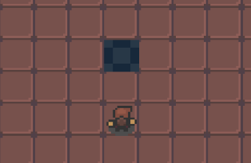
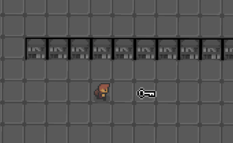

# Projeto `<B-Side Dungeon>`

# Descrição

B-Side Dungeon é um jogo linear no qual o mundo a ser explorado é composto por salas,
e o jogador deve resolver puzzles para prosseguir entre tais salas;

Cada sala do mundo real está ligada a uma sala do "mundo invertido", adicionando uma mecânica na qual
o protagonista tem a habilidade de “inverter o mundo”, permitindo que explore e atinja regiões antes inacessíveis;

A cooperação entre as ações realizadas nas salas normais e "invertidas" são essenciais para a resolução dos puzzles,
sendo o objetivo final: passar por todas as salas se libertando da Dungeon.

Para destrancar a porta e prosseguir para a proxima sala, o player deve encontrar uma chave, que destranca a porta,
e ativar um botao com items do cenário para abri-la usando a mecânica de inversão.

Utilizamos JavaSwing para a interface gráfica do jogo, e um design baseado em componentes que segue o padrão
MVC (model, view, controller)

# Equipe
* `Guilherme Buzzetti De Souza` - `235883`
* `Paulo Vitor Rodrigues Nogueira` - `247309`

# Arquivo Executável do Jogo

[Executável](start.jar)

# Estrutura de Arquivos e pastas

~~~
├── README.md          <- apresentação do projeto
│
├── data               <- dados usados pelo jogo
│
│
├── images             <- imagens auxiliares para a apresentação 
│   
│
├── bin                <- arquivos em bytecode (.class)
│   └── game     
│
├── src                <- arquivos-fonte do projeto (.java)
│   └── game     
│
└── assets             <- mídias usadas no projeto
~~~

# Slides do Projeto

[Slides](slide.pdf)

# Instrucoes de instalacao

    git clone https://github.com/KernelPointers/mc322-projects #Clone o repositorio
    cd lab06 #Entre no diretorio do jogo
    java -jar start.jar #Execute o arquivo .jar

# Como jogar

## Controles

* `w` - move o personagem para frente 

* `a` - move o personagem para esquerda

* `s` - move o personagem para baixo

* `d` - move o personagem para direita

* `e` - interage com items

* `c` - coleta a chave

* `i` - inverte o mundo

# Diagramas

## Diagrama MVC

## Diagrama Geral da Arquitetura do Jogo

# Arquitetura

## Componente `World`

World é o componente que representa o mundo do jogo.
Ele guarda um vetor de Nós no qual cada nó contem
dois objetos salas (uma sala 'normal' e sua respectiva 'anti-sala').
Cada sala é um objeto que contém uma matriz de células.

**Ficha Técnica**
item | detalhamento
----- | -----
Classe | `./src/game/world`
Interfaces | `WorldInterface, IntViewRoom, Ikeyboard`

## Componente `Body`

Body é o componente que representa os corpos que preenchem as salas.

**Ficha Técnica**
item | detalhamento
----- | -----
Classe | `./src/game/body`
Interfaces | `BodyInterface, IRoom, RIRoom`

## Componente `Controller`

Controller é o componente que controla o fluxo de execução do jogo.
A classe Control possui um método control.run que executa o jogo.
GameController possui o loop de execução do jogo, no qual recebe uma
interface de GraphicView e atualiza a imagem na tela.
    

**Ficha Técnica**
item | detalhamento
----- | -----
Classe | `./src/game/controller`
Interfaces | `ControllerInterface, RIWindow, Runnable`

## Componente `Builder`

Builder é o componente responsável pela instanciação do Mundo e suas instâncias de classes
    

**Ficha Técnica**
item | detalhamento
----- | -----
Classe | `./src/game/builder`
Interfaces | `BuilderInterface`

## Componente `GraphicView`

GraphicVIew é o componente responsável por mostrar na tela o conteudo atual da sala.
Através do Design Pattern Observer ele observa a sala de índice atual e atualiza
a vista cada vez que a sala é modificada.
A classe viewRoom contém uma matriz de viewCeells que tem como atributo a imagem a ser mostrada
em cada célula, atualizada de acordo com o modelo Room.
A classe Window é uma janela do swing que mostra as imagens da matriz do viewRoom na tela.
    

**Ficha Técnica**
item | detalhamento
----- | -----
Classe | `./src/game/graphicView`
Interfaces | `IntViewRoom, IWindow, RIKeyboardInput`

# Destaques de Orientacao a objetos

## Heranca e classe abstrata em body

Body e uma classe abstrata que representa os objetos que ocupam uma cell da matriz
de room

~~~java

    public abstract class Body implements BodyInterface, RIRoom{
        protected char id;
        protected int i, j; // coordenadas globais
        protected boolean isTangible = true;
        protected BufferedImage img[];
        protected IRoom room;
        protected BufferedImage currentImg;
    
        ...
        ...

    }

Ela e uma superclasse relativa a todos os tipos de objeto em body. E.g:

~~~java
    public class Player extends Body implements IPlayer {
    ...
    }
~~~

## Polimorfismo em cell

Cell recebe uma interface de body que foi instanciada em uma classe
especifica, caracterizando uma forma de polimorfismo

~~~java
    public class Cell {
    ...

        private BodyInterface body;
    ...

    }
~~~

# Design Patterns

## Factory

Utilizamos o Design Pattern Factory para a instanciação dos Componentes principais
do jogo, de modo que o cliente fique isento da instanciação dos objetos

~~~java
   public class AbstractFactory {
        public static IntBuilderFactory createBuilderFactory(){
            IntBuilderFactory factory = null;
            factory = new BuilderFactory();
            return factory;
        }

        public static IntWorldFactory createWorldFactory(){
            IntWorldFactory factory = null;
            factory = new WorldFactory();
            return factory;   
        }

        public static IntBodyFactory createBodyFactory(){
            IntBodyFactory factory = null;
            factory = new BodyFactory();
            return factory;
        }

        public static IntControllerFactory createControllerFactory(){
            IntControllerFactory factory = null;
            factory = new ControllerFactory();
            return factory;
        }

        public static IgraphicViewFactory createViewFactory(){
            IgraphicViewFactory factory = null;
            factory = new ViewFactory();
            return factory;
        }
    }
~~~
    
## Observer

Utilizamos também o Design Pattern Observer para realizar a ligação entre os objetos da matriz de Células das Salas
e sua respectiva viewRoom, de modo que a atualização da tela seja feita dinâmicamente.

~~~ java
    public class Room implements IRoom, Subject{
        ...
        private ArrayList<IntViewRoom> subscribers = new ArrayList<IntViewRoom>();
        ...
  
        public void attach(IntViewRoom obs){
            this.subscribers.add(obs);
        }

        public void detach(IntViewRoom obs){
            this.subscribers.remove(obs);
        }
 
        public void changeTargetRoom(Room room){
            IntViewRoom obs = this.subscribers.get(0);
            obs.toogleRoomStatus();
            obs.setSubject(room);
            obs.build();
            this.detach(obs);
            room.attach(obs);
        }    

        public void notifyObserver(int i, int j, BufferedImage img, char id){
            for (IntViewRoom obs : this.subscribers) 
                obs.update(i, j, img, id);
        }
        
        ...
    }
~~~

~~~java
    public interface IObs {
        public void update(int i, int j, BufferedImage img, char id);
        public void toogleRoomStatus();
        ...        
    }
~~~

~~~java
    public interface RIObs {
        public void setSubject(Subject sub);  
    }
~~~

~~~java
    public interface IntViewRoom extends 
            IObs, RIObs, IViewRoom{

    }
~~~

~~~java
    public class ViewRoom implements IntViewRoom{
    ...
        private Subject sub;
    ...

        @Override
        public void update(int i, int j, BufferedImage sprite, char id){
            if (id == 'p'){
                this.playerI = i;
                this.playerJ = j;
            }
            if (this.viewCells[i][j] != null)
                this.viewCells[i][j].setImg(sprite, id);
        }

        @Override
        public void setSubject(Subject sub){
            this.sub = sub;
        }

    }
~~~

# Destaques de Codigo

## Mecanicas

### Vetor de Orientacao

O personagem possui um vetor que indica a posicao para onde esta encarando, 
isso nos permite saber com qual celula o player pretende interagir ou coletar
e modificar o seu sprite de acordo com sua direcao

~~~java
    public class Player extends Body implements IPlayer {
        …
        private int[] ori = new int[2]; // vetor de orientacao
        …

        public void changeVectorOrientation(char dir){
            this.dir = dir;

            if (dir == 'u'){
                ori[0] = 0;
                ori[1] = -1;
                this.spriteIndex = (3);
            } else if (dir == 'd'){
                ori[0] = 0;
                ori[1] = 1;
                this.spriteIndex = (2);
            } else if (dir == 'r'){
                ori[0] = 1;
                ori[1] = 0;
                this.spriteIndex = (0);
            } else if (dir == 'l'){
                ori[0] = - 1;
                ori[1] = 0;
                this.spriteIndex = (1);
            } 

        

            this.currentImg = img[spriteIndex];

            this.room.notifyObserver(this.i, this.j, this.currentImg, 'p');
            this.updateNextPos();
        }

    …

    }
~~~

| ||
|-|-|
| | 

#### Interacao

~~~java
    public void interact(){
        this.updateNextPos();

        char nextId = this.room.getId(nextI, nextJ);

        if (this.isLinked)
            this.unlink();
        else {
            switch(nextId){
                case 'b' : 
                    this.linkBody(this.room.getBody(nextI, nextJ)); break;
                case 'k' :
                    this.linkBody(this.room.getBody(nextI, nextJ)); break;
                case 'd':
                    this.unlock();
            }
        }
    }

    ...

     public void collect(){
        
        this.updateNextPos();

        char nextId = this.room.getId(nextI, nextJ);

        if (this.isInventoryFull)
            this.drop(this.nextI, this.nextJ);
        else {
            switch(nextId){
                case 'k' : 
                    this.collectBody(this.room.getBody(nextI, nextJ)); break;
            }
        }
    }

    ...
~~~

| ||
|-|-|
| | 

### Botoes

| | ||

### Morrer

~~~java
    public void die(){
        int lastI = this.i, lastJ = this.j;
        
        if (this.room.getInv())
            this.changeRoom(this.room.getInverse(), i, j);

        this.room.swapBody(this.i, this.j, this.spawnI, this.spawnJ);
        
        this.unlink();
        if (this.isInventoryFull)
            this.drop(lastI, lastJ);
    }
~~~

| ||
|-|-|
| ||

### Inverter Mundos

~~~ java
    public void invert(){
        IRoom invRoom = room.getInverse();
        this.invertImg();
        if (invRoom.canMove(this.i, this.j)){
            this.changeRoom(this.room.getInverse(), this.i, this.j);
        }

        this.unlink();
    }
~~~

| ||

### Abrir Portas

~~~java
    ...
    public void unlock(){
            this.room.getBody(nextI, nextJ).interact(this.isInventoryFull);
            this.isInventoryFull = false;
            this.collectedItem = null;
    }
    ...

~~~

| ||

### Camera

A câmera do jogo segue o personagem de forma a centralizar este na tela, isso
é feito através de uma transformada de coordenadas quando a Window decide que porção
do view será mostrado na tela

~~~java
    public int transformX(int x){
        int tileWidth = 80;
        return x - 
            (this.viewRoom.getPlayerJ() * tileWidth ) + 
            (this.viewRoom.getPlayerScreenJ() * tileWidth);
    }

    public int transformY(int y){
        int tileHeight = 72;
        return y - 
            (this.viewRoom.getPlayerI() * tileHeight) + 
            (this.viewRoom.getPlayerScreenI() * tileHeight);
    }

    public void drawComponent(Graphics2D g, int x, int y, BufferedImage img) {  
        if (img != null){
            int newX = transformX(x);
            int newY = transformY(y);
            g.setRenderingHint(RenderingHints.KEY_ANTIALIASING, 
                               RenderingHints.VALUE_ANTIALIAS_ON);
            AffineTransform restoreMatrix = g.getTransform();
            g.rotate(this.angle, this.viewRoom.getPlayerScreenI(), 
            this.viewRoom.getPlayerScreenJ());
            …
            g.drawImage(img, newX, newY, 80, 80, this);
            …
            g.setTransform(restoreMatrix);
        }

    }  

~~~

#### Transformada de coordenadas

Dado esse referencial onde o eixo em roxo representa as coordenadas absolutas, e o em vermelho
as coordenadas relativas ao Player, quremos levar os pontos do eixo absoluto para o eixo do Player.
Desta forma, efetuamos a transformada:

* `T: (x, y) -> (x - Xpa + Xpt  , y - Ypa + Ypt)`

Onde (Xpa, Ypa) é a coordenada absoluta do player e (Xpt, Ypt) é a coordenada do Player em relação 
a tela (origem do eixo de destino da transformada T).

| ||

# Problemas, correcoes e mudancas Para o Futuro

Devido a restricoes de tempo, nao conseguimos finalizar o jogo conforme planejado de forma que:

* Nao foi possivel finalizar todos os puzzles, desta forma, o jogo
possui apenas duas fases, no entanto, e possivel implementar niveis facilmente alterando os csv's do diretorio ./data

* O jogo nao possui um sistema que reconheca quando deveria acabar

## Criando Fases

O atributo layoutNum de builder determina quantos nos de salas serao construidos

~~~java
    public class Builder implements BuilderInterface{
        ...
        private int layoutNum = 2;
        ...

    }
~~~

Para criar uma nova fase, basta editar esse atributo somando um no seu valor atual
e adicionar dois arquivos csv's cada um com uma matriz de 30 x 48 de caracteres do keycode abaixo, nos diretorios
./data/normal e ./data/inverted respectivamente, sendo que o adicionado no primeiro
representa o mundo normal a ser construido e o segundo o invertido.

Cada no deve conter pelo menos uma porta no lado esquerdo do mapa normal, um botao e uma chave,
apenas a sala inicial pode conter o player, e apenas a sala normal deve conter uma porta

* keycode:

char | body
----- | -----
p | player
\# | empty cell
B | rigid block
b | block
a | button
d | door
w | wall
k | key
v | void
s | spike
h | hole

